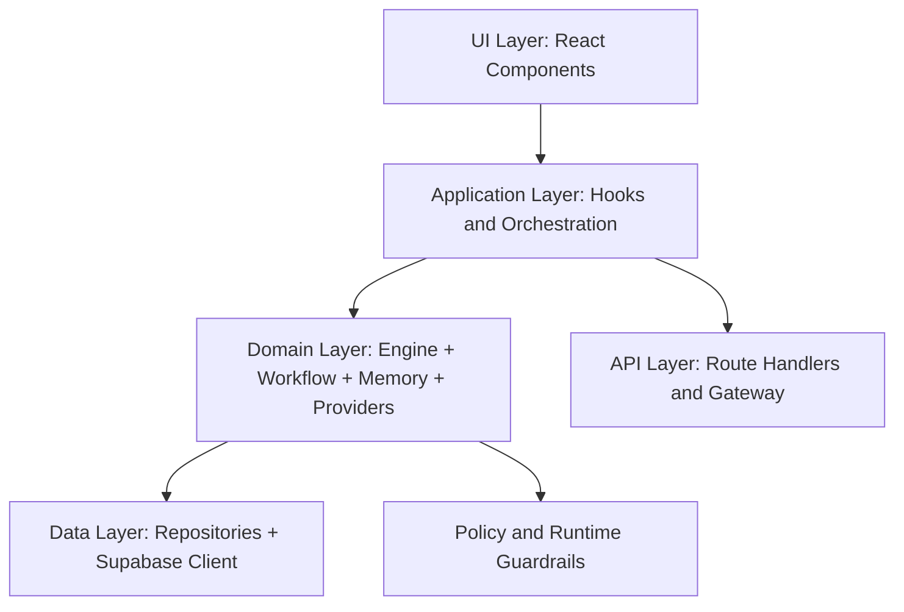

# Ashim Architecture Specification

## 1. Purpose
This document describes the architecture used for the Ashim capstone implementation.

The architecture was designed before implementation and then executed during an 8-week build phase.

## 2. Design Principles
- Clear module boundaries.
- Type-safe interfaces across layers.
- BYOK-first security model.
- Testable services and repository abstractions.
- Deployment readiness through reproducible scripts.

## 3. Layered Architecture

## 4. Main Modules
### UI Layer
- `components/*`, `src/components/*`
- Chat surfaces, settings, admin panels, and interaction views.

### Application Layer
- `hooks/*`, `src/hooks/*`
- Coordinates UI actions and runtime modules.

### Domain Layer
- `src/engine/*`: core runtime behavior.
- `src/workflows/*`: workflow planning and execution.
- `src/providers/*`: model/provider routing.
- `src/byok/*`: key management and validation.

### Data Layer
- `src/data/repositories/*`
- Enforces database boundary and centralizes persistence logic.

### API Layer
- `src/api/*`
- Route handling, request validation, and response shaping.

## 5. Key Architectural Decisions
- **BYOK by default**: provider keys are user-controlled.
- **Repository boundary enforcement**: direct DB access is restricted to repository modules.
- **Feature-based modularization**: chat, memory, workflows, and providers are separated by domain.
- **Deployment parity**: Docker compose flow mirrors production-like setup.

## 6. Quality and Reliability Controls
- Static checks: `npm run lint`, `npm run typecheck`
- Automated tests: `npm run test`, `npm run ci`
- Build validation: `npm run build`
- Deploy preflight gate: `npm run deploy:preflight`

## 7. Future Extension Path
The current architecture supports incremental extension in these areas:
- richer workflow actions,
- improved policy enforcement,
- expanded plugin and connector ecosystem,
- stronger observability around runtime execution.
